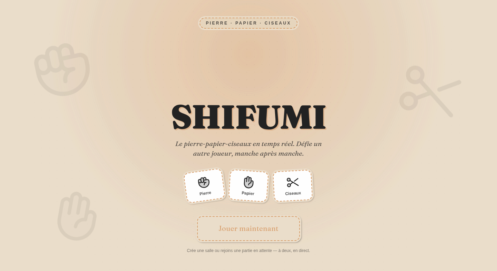

# Shifumi — Frontend

Two-player, real-time **Rock-Paper-Scissors** (Pierre · Papier · Ciseaux) game built with Next.js. This is the web client; it talks to the [Shifumi backend](../Shifumi-backend) over HTTP and SSE.



## Features

-  Create a game and share it, or join an existing one
-  Real-time rounds over Server-Sent Events (SSE)
-  Installable PWA (manifest + service worker, standalone display)
-  Tailwind CSS v4 + SCSS modules, warm minimalist UI
-  Lightweight global state with Zustand

## Tech stack

- [Next.js 16](https://nextjs.org) (App Router) + [React 19](https://react.dev)
- TypeScript (strict mode)
- [Zustand](https://github.com/pmndrs/zustand) for state
- [Tailwind CSS v4](https://tailwindcss.com) + SCSS modules
- [Phosphor Icons](https://phosphoricons.com)

## Getting started

### Prerequisites

- Node.js 20+ (or [Bun](https://bun.sh))
- A running [Shifumi backend](../Shifumi-backend) (defaults to `http://localhost:8080`)

### Install

```bash
npm install
# or
bun install
```

### Configure

The backend URL is read from `NEXT_PUBLIC_API_URL`. Copy the example file and adjust if your backend is not on the default host:

```bash
cp .env.example .env.local
```

When unset, it falls back to `http://localhost:8080`.

### Run the dev server

```bash
npm run dev
```

Open [http://localhost:3000](http://localhost:3000) in your browser.

## Available scripts

| Command | Description |
| --- | --- |
| `npm run dev` | Start the development server on port 3000 |
| `npm run build` | Create a production build |
| `npm run start` | Run the production build |
| `npm run lint` | Lint the codebase with ESLint |


## How it works

1. A player **creates a game** — the backend returns a game ID (`game-1`, `game-2`, …).
2. A second player **joins** with their username; the game becomes `ready`.
3. Each player submits a choice (`rock` | `paper` | `scissors`). When both have played, the backend resolves the round, updates the score, and broadcasts the result.
4. The client stays in sync by subscribing to `GET /game/:id/events` (SSE): it receives a `game.snapshot` first, then a stream of `game.updated` and `round.completed` events.

> **Note:** backend game state is in-memory and process-local, so games are lost when the backend restarts.

## License

Private project.
